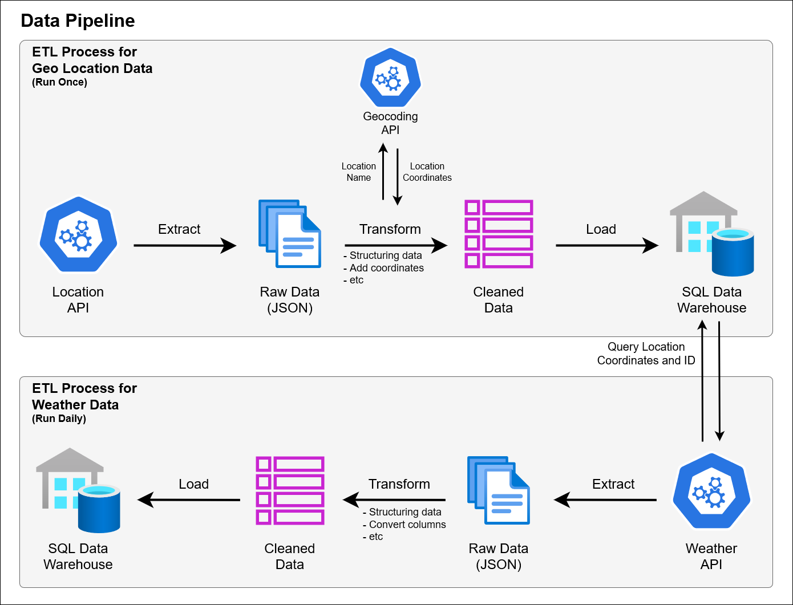

<!-- Improved compatibility of back to top link: See: https://github.com/othneildrew/Best-README-Template/pull/73 -->
<a name="readme-top"></a>


<!-- PROJECT LOGO -->
<br />
<div align="center">
<h3 align="center">Weather Data Pipeline</h3>
  <p align="center">
    Developing data pipeline to extract daily weather data by performing ETL (Extract, Transform, Load) processes to ingest the data into a data warehouse.
    <br />
    <br />
    <!--<a href="#">View Demo</a>-->
  </p>
</div>


<!-- TABLE OF CONTENTS -->
<details>
  <summary>Table of Contents</summary>
  <ol>
    <li>
      <a href="#about-the-project">About The Project</a>
    </li>
    <li>
      <a href="#getting-started">Getting Started</a>
      <ul>
        <li><a href="#prerequisites">Prerequisites</a></li>
        <li><a href="#installation">Installation</a></li>
      </ul>
    </li>
    <li><a href="#usage">Usage</a></li>
    <li><a href="#To Do">To Do</a></li>
    <li><a href="#contact">Contact</a></li>
    <li><a href="#acknowledgments">Acknowledgments</a></li>
  </ol>
</details>


<!-- ABOUT THE PROJECT -->
## About The Project



This project aims to demonstrate a data engineering workflow by creating a batch processing data pipeline for extracting daily weather data. It involves performing ETL (Extract, Transform, Load) processes to ingest the data into a data warehouse.

As shown in the image above, this pipeline involves two ETL processes: one for geo-location, which runs only once (since it's static data), to obtain location details such as province, city, district, and coordinates. While another ETL for weather data, which runs daily to gather information such as temperature, precipitation, wind speed, etc.

<p align="right">(<a href="#readme-top">back to top</a>)</p>


<!--
<!-- GETTING STARTED -->
## Getting Started

Here are a few steps to follow in order to run the project locally on your computer.

### Prerequisites

Before doing the installation, make sure you have Docker installed on your computer. For the installation guide, you can refer to Docker official documentation.

### Installation

1. Clone the repo
   ```sh
   git clone https://github.com/alfiannajih/weather-data-pipeline.git
   ```
2. Run docker compose inside the project folder
   ```sh
   docker compose up -d
   ```
3. Open the Airflow UI in your web browser by entering the URL below and login with `username: airflow` and `password: airflow`
   ```
   localhost:8080
   ```

<p align="right">(<a href="#readme-top">back to top</a>)</p>


<!-- USAGE EXAMPLES -->
## Usage

<p align="right">(<a href="#readme-top">back to top</a>)</p>


<!-- To Do -->
## To Do

- [x] Create DAG for geo location data
    - [x] Create extract task
    - [x] Create transform task
    - [x] Create load task
- [x] Create DAG for weather data
    - [x] Create extract task
    - [x] Create transform task
    - [x] Create load task
- [x] Add parameter for scheduling DAG
- [ ] Documenting README.md
    - [x] Documenting project description
    - [ ] Documenting usage content


<p align="right">(<a href="#readme-top">back to top</a>)</p>


<!-- CONTACT -->
## Contact

Bahrul Alfian Najih - [Linkedin](https://www.linkedin.com/in/bahrul-alfian-najih/) - alfiannajih@gmail.com

<p align="right">(<a href="#readme-top">back to top</a>)</p>


<!-- ACKNOWLEDGMENTS -->
## Acknowledgments

- [Airflow Documentation](https://airflow.apache.org/docs/apache-airflow/stable/index.html)
- [Geoapify](https://www.geoapify.com/)
- [Open-Meteo API](https://open-meteo.com/)
- [Sipedas API](https://sipedas.pertanian.go.id/api/wilayah/index)
<p align="right">(<a href="#readme-top">back to top</a>)</p>